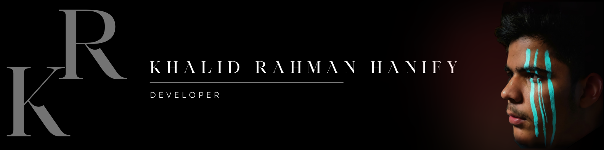

  

  <h1>
    
  </h1>

---

##  About Me

🎓 **BCS Student at Kardan University** passionate about building modern applications and continuously learning new technologies.

💻 Interested in **Full Stack Development, AI, Python, Web Development, and Problem Solving**.

🚀 Currently working on projects involving **Python, JavaScript, and Web Applications**.

     

---

##  GitHub Overview

##  Tech Stack

---

##  GitHub Stats

<picture>
  <source
    srcset="https://github-readme-stats.vercel.app/api?username=khalidrahmanhanify&show_icons=true&theme=dark&title_color=e4e6eb&icon_color=00FFAA&hide_border=true&bg_color=16161c&border_radius=15"
    media="(prefers-color-scheme: dark)"
  />
  
</picture>

 
 

 

---

##  Featured Projects

---

##  Activity Graph

---

##  Contribution Snake

---

##  Daily Dev Quote

---

##  Profile Views

---

###  “Always learning, always building.”

